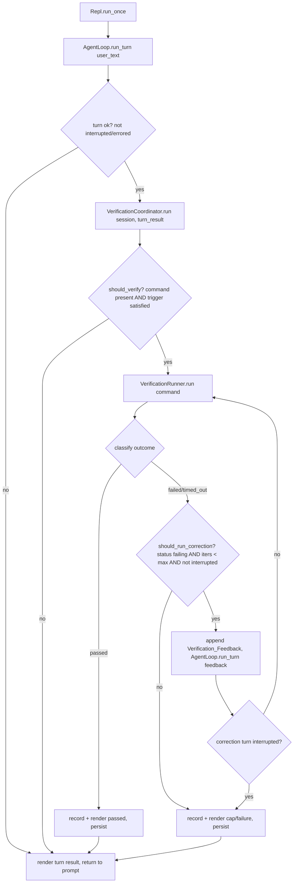
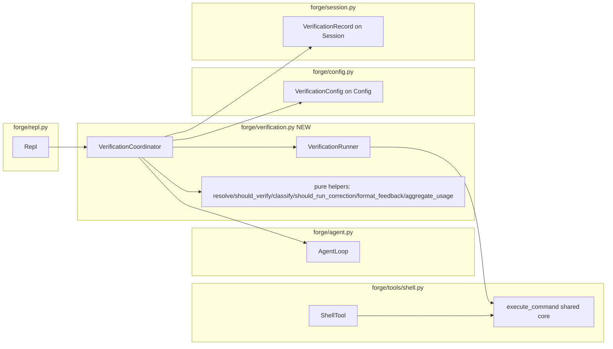

# Design Document

## Overview

The Auto-Verification Loop adds a post-turn **Verification_Phase** to Forge. Today the REPL runs one agent turn (`AgentLoop.run_turn`) and immediately renders the result, regardless of whether the just-edited code still builds, tests, or lints. This feature inserts an opt-in phase, gated by a user-configured `verification.command`, that runs after a turn completes normally. It runs the Verify_Command, classifies the outcome, and — on failure — feeds the captured output back to the Model as a synthesized message and re-runs the turn, looping a bounded number of times until verification passes or the iteration cap is reached.

The design is grounded in the existing Forge architecture and reuses its primitives rather than adding parallel machinery:

- **Shell execution machinery** (`forge/tools/shell.py`): platform default shell, wall-clock timeout, combined-output character cap, process-tree termination, and sub-second interrupt polling. The Verification_Runner reuses this by extracting the existing execution core into a shared helper.
- **`AgentLoop.run_turn`**: a correction iteration is simply another `run_turn` call whose "user" message is the synthesized Verification_Feedback. This gives the same context assembly, streaming, and tool execution for free (Req 7.3).
- **`InterruptController`**: the shared SIGINT event already polled by the shell tool and the agent loop. The phase brackets the Verify_Command runs so Ctrl-C trips during verification too (Req 8).
- **`UsageTracker`** and **`SessionStore`**: usage already accumulates into cumulative totals across `record` calls, and session writes are already atomic. The phase aggregates per-turn usage across iterations and persists structured verification records.

The feature is strictly opt-in: when `verification.command` is absent, the REPL behaves exactly as it does today — no Verify_Command process is started, no feedback is appended, and end-of-turn rendering and persistence are unchanged (Req 2).

### Design goals

1. **Zero behavior change when unconfigured.** The gating decision is the first thing evaluated; an absent command short-circuits the entire phase.
2. **Maximal reuse.** No new shell runner, no new turn engine, no new persistence format — extend or wrap what exists.
3. **Always terminates.** The correction loop is bounded by `Max_Correction_Iterations` and a pure loop-control predicate that can never exceed the cap.
4. **Pure, testable decision logic.** Config resolution, trigger gating, outcome classification, loop control, feedback formatting, and usage aggregation are pure functions, separated from I/O so they can be property-tested.

## Architecture

The Verification_Phase is orchestrated by a new `VerificationCoordinator` that sits between the `Repl` and the `AgentLoop`. The `Repl` continues to run the user's turn through `AgentLoop.run_turn`; after that turn completes it hands control to the coordinator, which decides whether to verify and drives the bounded loop.



### Component placement



### Control flow within the phase

1. **Gate.** `should_verify(command_present, trigger, mutated_files, turn_ok)` decides whether to run at all (Req 2, 3). If false, the coordinator returns "not run" and the Repl renders the original turn result unchanged.
2. **Initial verify.** The Verify_Command runs once unconditionally when the gate passes, even when `Max_Correction_Iterations` is 0 (Req 5.6, 5.7).
3. **Classify.** The raw command execution maps to a `Verification_Result` status: `passed`, `failed`, `timed_out`, or `start_error` (Req 4).
4. **Loop.** While `should_run_correction(latest_status, completed_iterations, max, interrupted)` is true, append a Verification_Feedback message, run a correction turn, then re-run the Verify_Command (Req 5).
5. **Terminate.** The loop ends on the first `passed`, on reaching the cap, or on interrupt; the final result, iteration count, and aggregated usage are recorded, persisted, and rendered (Req 6, 8, 9, 10, 11).

### Interrupt bracketing

`run_turn` already brackets itself with `InterruptController.begin_turn`/`end_turn`, so correction turns observe Ctrl-C and report `TurnResult.interrupted`. The Verify_Command runs *outside* `run_turn`, where the controller would otherwise be idle (and Ctrl-C a no-op). The coordinator therefore brackets each Verify_Command execution with `begin_turn`/`end_turn` so the shell core's interrupt polling trips within one second (Req 8.1). Between a correction turn and the next Verify_Command, the coordinator keys off `TurnResult.interrupted` (not the raw event, which `end_turn` clears) to decide whether to halt (Req 8.2, 8.4).

## Components and Interfaces

### 1. VerificationConfig (in `forge/config.py`)

A resolved, validated configuration block for the feature, added to `Config` as `verification: VerificationConfig`. The `ConfigManager._from_raw` path parses the new `[verification]` TOML table and applies the documented defaults.

```python
@dataclass(frozen=True)
class VerificationConfig:
    command: str | None = None              # verification.command; None => disabled
    max_correction_iterations: int = 3      # verification.max_correction_iterations
    trigger: str = "on_file_change"         # verification.trigger: on_file_change | always
    timeout_s: int = 120                    # verification.timeout_s; default = shell_timeout_s
    output_cap_chars: int = 30_000          # inherits limits.output_cap_chars
```

Resolution rules (Req 1):
- `command`: read from `verification.command`; absent → `None` (feature disabled) (1.1, 1.2).
- `max_correction_iterations`: absent → `3` (1.3); present must be an integer `>= 0`, else `ConfigError` naming the offending value (1.5).
- `trigger`: absent → `"on_file_change"` (1.4); present must be one of `on_file_change` / `always`, else `ConfigError` naming the offending value and the allowed set (1.6).
- `timeout_s`: absent → the resolved `shell_timeout_s` (1.7); present positive integer → that value (1.8).
- `output_cap_chars`: inherits the resolved `limits.output_cap_chars`.

A pure helper drives this so it can be property-tested independently of file I/O:

```python
def resolve_verification_config(
    raw: dict | None, *, shell_timeout_s: int, output_cap_chars: int
) -> VerificationConfig: ...
```

`ConfigManager` validates the raw values and raises `ConfigError` for invalid `max_correction_iterations` (non-integer or `< 0`) and invalid `trigger`, consistent with the existing explicit-configuration style.

### 2. VerificationRunner (in `forge/verification.py`)

Executes the Verify_Command and produces a `Verification_Result`, reusing the shell execution core.

```python
class VerificationRunner:
    def __init__(self, workspace_root: Path, interrupt: InterruptController) -> None: ...
    def run(self, command: str, *, timeout_s: int, output_cap: int) -> VerificationResult: ...
```

To reuse the existing machinery (Req 4.1) without duplicating it, the shell tool's execution body is extracted into a module-level helper in `forge/tools/shell.py`:

```python
@dataclass(frozen=True)
class CommandExecution:
    stdout: str
    stderr: str
    exit_code: int | None
    timed_out: bool
    interrupted: bool
    spawn_error: str | None   # None unless the process could not be started

def execute_command(
    command: str,
    *,
    workspace_root: Path,
    interrupt: InterruptController | None,
    timeout_s: int,
    output_cap: int,
) -> CommandExecution: ...
```

`ShellTool.run` is refactored to call `execute_command` and wrap the result into a `ToolResult` exactly as today (its observable behavior is unchanged). `VerificationRunner.run` calls the same `execute_command` and maps the raw execution to a `VerificationResult` via the pure `classify_outcome` helper:

```python
def classify_outcome(execution: CommandExecution) -> str:
    # spawn_error -> "start_error"
    # timed_out   -> "timed_out"
    # exit_code == 0 -> "passed"
    # otherwise   -> "failed"
```

Output capping (Req 4.6) reuses the shell core's existing cap logic; the `VerificationResult` carries `truncated=True` when the rendered combined output exceeded the cap.

### 3. VerificationCoordinator (in `forge/verification.py`)

Owns the phase orchestration. It is the single entry point the Repl calls after a turn.

```python
class VerificationCoordinator:
    def __init__(
        self,
        config: VerificationConfig,
        runner: VerificationRunner,
        agent_loop: AgentLoop,
        session_store: SessionStore,
        interrupt: InterruptController,
        renderer: "VerificationRenderer | None" = None,
    ) -> None: ...

    def run(self, session: Session, turn_result: TurnResult) -> VerificationPhaseResult: ...
```

`run` algorithm:
1. Compute `should_verify(command_present=self.config.command is not None, trigger=self.config.trigger, mutated_files=turn_result.mutated_files, turn_ok=not (turn_result.interrupted or turn_result.error))`. If false → return `VerificationPhaseResult(ran=False, ...)` carrying the original turn usage (Req 2, 3).
2. `begin_turn()`; run the initial Verify_Command via the runner; `end_turn()`. Render the running indicator before, and the pass/fail indicator after (Req 9.1–9.3). Record the per-iteration usage delta from any preceding turn.
3. Initialize `completed_iterations = 0`, `latest = initial_result`.
4. While `should_run_correction(latest.outcome, completed_iterations, self.config.max_correction_iterations, interrupted)`:
   - Render the correction-iteration indicator `n/max` (Req 9.4).
   - `feedback = format_feedback(self.config.command, latest)`; run `agent_loop.run_turn(session, feedback)` (Req 5.3, 7.3). `run_turn` appends and persists the feedback message (Req 11.1).
   - If the correction turn's `TurnResult.interrupted` → set `interrupted=True`, break before starting any new iteration (Req 8.2, 8.4).
   - `completed_iterations += 1`.
   - `begin_turn()`; re-run the Verify_Command; `end_turn()`. If the runner observed an interrupt, break (Req 8.1).
   - `latest = new_result`.
5. If the loop ended at the cap without a pass, render the cap-reached indicator (Req 6.2, 9.5).
6. Build the `VerificationRecord`, attach it to the session, aggregate usage across the original turn and all correction turns, persist the session (atomic write completes before returning — Req 8.3, 11.2), and return the `VerificationPhaseResult`.

Pure helpers (all property-testable, no I/O):

```python
def should_verify(command_present: bool, trigger: str, mutated_files: bool, turn_ok: bool) -> bool:
    return command_present and turn_ok and (trigger == "always" or mutated_files)

def should_run_correction(latest_outcome: str, completed_iterations: int, max_iterations: int, interrupted: bool) -> bool:
    return (
        not interrupted
        and latest_outcome in {"failed", "timed_out"}
        and completed_iterations < max_iterations
    )

def format_feedback(command: str, result: VerificationResult) -> str: ...
def aggregate_usage(turn_usages: list[UsageSummary]) -> UsageSummary: ...
```

Note `should_run_correction` makes `start_error` non-correctable (a command that cannot start will not be "fixed" by editing code), and `passed` terminating is implicit because `passed` is not in the failing set. `max_iterations == 0` yields `False` immediately, so the initial verify runs once with no corrections (Req 5.6).

### 4. AgentLoop change: File_Mutation tracking (in `forge/agent.py`)

`TurnResult` gains a `mutated_files: bool` field. During `_execute_tool_calls`, a successful (`result.ok`) call to the `write` or `edit` tool sets a turn-local flag, surfaced on the returned `TurnResult`. This is the cleanest signal for the `on_file_change` trigger (Req 3.1, 3.2): the executing loop knows both the tool name (`call.name`) and the success status, which a downstream inspector of `ToolResultRecord` alone cannot easily correlate.

```python
@dataclass(frozen=True)
class TurnResult:
    usage: UsageSummary
    compaction: CompactionInfo | None = None
    error: str | None = None
    interrupted: bool = False
    mutated_files: bool = False   # NEW: a write/edit returned ok within this turn
```

`File_Mutation` is defined precisely as: a `ToolResult` with `ok=True` from a tool named `write` or `edit`.

### 5. VerificationRenderer + Repl integration (in `forge/repl.py`)

A small protocol (mirroring the existing `Renderer` pattern: optional, defensively invoked) the coordinator drives:

```python
class VerificationRenderer(Protocol):
    def on_verification_start(self, command: str) -> None: ...
    def on_verification_result(self, result: VerificationResult) -> None: ...
    def on_correction_iteration(self, iteration: int, max_iterations: int) -> None: ...
    def on_verification_cap_reached(self, result: VerificationResult, iterations: int) -> None: ...
```

`Repl` implements these (Req 9):
- `on_verification_start` → `[verify] running: <command>` (9.1).
- `on_verification_result` → `[verify] passed` (9.2) or `[verify] failed (<status>)` for `failed`/`timed_out`/`start_error` (9.3).
- `on_correction_iteration` → `[verify] correction iteration <n>/<max>` (9.4).
- `on_verification_cap_reached` → clears the running indicator and prints `[verify] iteration cap reached (<max>); final status: <status>` (9.5).

`Repl.run_once` is updated so that, after a turn that is not interrupted/errored, it calls the coordinator (when wired) and renders the phase's aggregated usage instead of the bare turn usage; when verification did not run, rendering is exactly as today (Req 2.3).

### 6. Wiring (in `forge/app.py`)

`bootstrap` constructs the `VerificationRunner` (rooted at the workspace, sharing the `InterruptController`) and the `VerificationCoordinator` (sharing the `AgentLoop`, `SessionStore`, interrupt, and the `Repl` as `VerificationRenderer`), and passes the coordinator to the `Repl`. When `config.verification.command` is `None`, the coordinator is still wired but short-circuits at the gate, preserving today's behavior with no special-casing in the Repl.

## Data Models

### VerificationResult

The structured outcome of one Verify_Command execution.

```python
@dataclass(frozen=True)
class VerificationResult:
    outcome: str            # "passed" | "failed" | "timed_out" | "start_error"
    exit_code: int | None   # present when the process ran to completion
    output: str             # captured combined output (possibly truncated)
    truncated: bool = False # True when output exceeded the configured cap
```

### VerificationPhaseResult

Returned by `VerificationCoordinator.run` to the Repl.

```python
@dataclass(frozen=True)
class VerificationPhaseResult:
    ran: bool                          # False when the gate skipped the phase
    final_result: VerificationResult | None
    iterations_performed: int          # number of Correction_Iterations completed
    cap_reached: bool                  # ended at the cap without passing
    interrupted: bool
    usage: UsageSummary                # aggregated across the turn + all corrections
```

### VerificationRecord (persisted on Session)

`Session` gains `verification_records: list[VerificationRecord]` so resuming a session preserves the record of what was verified and corrected (Req 11). Serialization follows the existing lossless `*_to_dict` / `*_from_dict` pattern in `forge/session.py`, extending `session_to_dict` / `session_from_dict` so the round-trip equality invariant continues to hold.

```python
@dataclass
class VerificationRecord:
    command: str
    outcome: str                # final Verification_Result outcome status
    exit_code: int | None
    iterations: int             # Correction_Iterations performed
    cap_reached: bool
    truncated: bool
```

The captured failure output is not duplicated into the record; it already lives verbatim in the persisted Verification_Feedback messages (normal `Message`s appended by the correction turns), which round-trip via the existing message serialization.

### Verification_Feedback message

A synthesized message appended as the `user_text` of a correction turn (so `run_turn` persists it — Req 11.1). `format_feedback` renders, deterministically:

```
The verification command failed. Please fix the underlying problem.

Command: <command>
Status: <outcome>
Exit code: <exit_code or "unavailable">
Output (truncated):      # the "(truncated)" marker only when result.truncated
<captured combined output>
```

### Config TOML schema addition

```toml
[verification]
command = "pytest -q"            # optional; absent disables the feature
max_correction_iterations = 3   # integer >= 0
trigger = "on_file_change"      # "on_file_change" | "always"
timeout_s = 120                 # optional; defaults to limits.shell_timeout_s
```

## Correctness Properties

*A property is a characteristic or behavior that should hold true across all valid executions of a system — essentially, a formal statement about what the system should do. Properties serve as the bridge between human-readable specifications and machine-verifiable correctness guarantees.*

The properties below were derived from the acceptance-criteria prework. Each is universally quantified and isolates a pure decision function (config resolution, trigger gating, outcome classification, loop control, feedback formatting, usage aggregation) or the lossless serialization invariant, so it can be exercised with generated inputs and no real I/O.

### Property 1: Configuration resolution applies documented defaults and reads present values

*For any* raw `[verification]` mapping and any resolved `shell_timeout_s` and `output_cap_chars`, resolving the verification configuration yields: `command` equal to the provided `verification.command` or `None` when absent; `max_correction_iterations` equal to the provided integer or `3` when absent; `trigger` equal to the provided allowed value or `on_file_change` when absent; and `timeout_s` equal to the provided positive integer or `shell_timeout_s` when absent.

**Validates: Requirements 1.1, 1.2, 1.3, 1.4, 1.7, 1.8**

### Property 2: Configuration validation rejects invalid values

*For any* `verification.max_correction_iterations` value that is not an integer `>= 0`, and *for any* `verification.trigger` value that is not one of `on_file_change` or `always`, resolution raises a `ConfigError` whose message names the offending value (and, for `trigger`, the allowed values).

**Validates: Requirements 1.5, 1.6**

### Property 3: Trigger decision gates the phase correctly

*For any* combination of command presence, trigger, file-mutation flag, and turn-completion status, the Verification_Phase runs if and only if the command is present AND the turn completed normally (not interrupted, no error) AND (the trigger is `always` OR the turn produced at least one File_Mutation). When the decision is false, no Verify_Command process is started and no Verification_Feedback is appended to the Session.

**Validates: Requirements 2.1, 2.2, 3.1, 3.2, 3.3, 3.4**

### Property 4: Outcome classification maps execution to status

*For any* command execution, the resulting Verification_Result outcome is `start_error` when the process could not be started; otherwise `timed_out` when the execution timed out (regardless of whether process-tree termination succeeded); otherwise `passed` when the exit code is `0`; otherwise `failed`, in which case the exit code and the captured combined output are preserved on the result.

**Validates: Requirements 4.2, 4.3, 4.4, 4.5, 4.7**

### Property 5: Output capping truncates to the configured cap

*For any* captured combined output and any non-negative output cap, the Verification_Result's output length never exceeds the cap, and the result is flagged truncated if and only if the original output length exceeded the cap.

**Validates: Requirements 4.6, 7.2**

### Property 6: The correction loop is bounded and terminates correctly

*For any* configured `Max_Correction_Iterations` (`>= 0`) and *any* sequence of Verification_Results produced across iterations, a gated-in Verification_Phase runs the initial Verify_Command exactly once before any Correction_Iteration, performs at most `Max_Correction_Iterations` Correction_Iterations, performs zero Correction_Iterations when `Max_Correction_Iterations` is 0, stops immediately upon the first `passed` result, and begins no further Correction_Iteration once an Interrupt has halted the phase.

**Validates: Requirements 5.1, 5.2, 5.4, 5.5, 5.6, 5.7, 6.1, 6.3, 8.4**

### Property 7: Verification_Feedback includes the failure details

*For any* non-passing Verification_Result and any Verify_Command, the formatted Verification_Feedback message includes the Verify_Command, the outcome status, the exit code when available (and an explicit "unavailable" marker otherwise), and the captured combined output, and indicates truncation exactly when the result is flagged truncated.

**Validates: Requirements 7.1, 7.2**

### Property 8: Phase usage aggregates every Model request

*For any* sequence of per-turn usage summaries produced by the original turn and the Correction_Iterations, the aggregated phase usage reports turn token counts equal to the sum of every turn's token counts and cumulative token counts equal to the final cumulative totals, and the persisted Session usage equals that aggregated cumulative total.

**Validates: Requirements 10.1, 10.2, 10.3**

### Property 9: Verification records and feedback round-trip losslessly

*For any* Session containing Verification_Feedback messages and Verification_Records, serializing the Session to JSON and deserializing it reconstructs an equal Session, preserving every feedback message, the final Verification_Result outcome status, and the number of Correction_Iterations performed.

**Validates: Requirements 11.1, 11.2, 11.3**

## Error Handling

The phase distinguishes several failure modes and never lets one of them crash the REPL or lose session state:

- **Verify_Command non-zero exit (`failed`).** The normal failure path: classified `failed`, fed back to the Model, and corrected within the bounded loop. Not an error from Forge's perspective.
- **Verify_Command timeout (`timed_out`).** The shell core terminates the process tree and reports `timed_out`. If termination itself does not succeed, the result is still `timed_out` (Req 4.5); `timed_out` is correctable like `failed`.
- **Verify_Command cannot start (`start_error`).** Classified `start_error`, rendered to the user, and treated as non-correctable by `should_run_correction` (editing code will not fix an unstartable command). The phase ends and returns to the prompt.
- **Invalid configuration.** `ConfigManager` raises `ConfigError` for an invalid `max_correction_iterations` or `trigger` at load time, surfaced through the existing startup error path before the REPL runs (consistent with how other config errors are handled in `forge/app.py`).
- **Interrupt.** A Ctrl-C during the Verify_Command trips the shared interrupt event (the phase brackets the run with `begin_turn`/`end_turn`); the shell core terminates the tree within one second. A Ctrl-C during a correction turn is reported by `run_turn` as `TurnResult.interrupted`. In both cases the phase halts, begins no new iteration, retains all already-appended messages and feedback, and completes the in-progress atomic Session write before returning (Req 8.3).
- **Vertex/model error during a correction turn.** `run_turn` already ends the turn gracefully with `TurnResult.error` set and the session preserved. The coordinator treats an errored correction turn as a halt condition (it stops driving the loop) and surfaces the latest Verification_Result, mirroring the interrupt handling.
- **Session persistence.** Reuses `SessionStore.save`'s atomic temp-file-plus-replace, so a crash mid-write never corrupts the stored session; retention is all-or-nothing (Req 8.3, 11).

## Testing Strategy

Property-based testing is appropriate for this feature: its core is a set of pure decision functions (config resolution, trigger gating, outcome classification, output capping, bounded loop control, feedback formatting, usage aggregation) and a lossless serialization invariant — each expressible as "for all inputs, property holds." The I/O-bound and UI parts (real process termination timing, renderer output, shell wiring) are covered by example and integration tests instead.

### Property-based tests

The project already uses **Hypothesis** (see `.hypothesis/` and the existing `test_*_properties.py` suites); the new property tests use it too. They are not implemented from scratch.

- Each correctness property (1–9) is implemented as a single property-based test.
- Each property test runs a **minimum of 100 iterations**.
- Each property test is tagged with a comment referencing the design property, in the format: **Feature: auto-verification-loop, Property {number}: {property_text}**.
- Generators cover edge cases called out in the prework: empty/whitespace commands, output exactly at and just over the cap, `Max_Correction_Iterations` of 0 and large values, missing exit codes (timeouts/start errors), non-ASCII output, and sessions with zero, one, and many verification records and feedback messages.

Mapping of properties to test targets:
- P1, P2 → `resolve_verification_config` and `ConfigManager` validation.
- P3 → `should_verify`.
- P4 → `classify_outcome`.
- P5 → the runner's output-cap path (using the shared shell-core capping).
- P6 → `should_run_correction` plus a coordinator-level test driving a scripted runner (always-failing, fail-then-pass) with a mock `AgentLoop` to assert iteration counts and ordering.
- P7 → `format_feedback`.
- P8 → `aggregate_usage` and the persisted `session.usage`.
- P9 → `session_to_json` / `session_from_json` extended with `VerificationRecord` and feedback messages.

### Unit (example) tests

- Opt-in equivalence: command absent → Repl renders and persists exactly as today (Req 2.3).
- One Correction_Iteration sequence: feedback appended, `AgentLoop.run_turn` invoked, Verify_Command re-run, in that order (Req 5.3, 7.3).
- Cap-reached surfacing: `on_verification_cap_reached` called with the final result and iteration count (Req 6.2).
- Renderer indicators for running / passed / failed(status) / iteration `n/max` / cap-reached (Req 9.1–9.5).
- Interrupt retention: a scripted interrupt mid-phase leaves previously appended feedback intact and the persisted session complete (Req 8.3).

### Integration tests

- Shell reuse: the Verify_Command runs through the platform default shell rooted at the workspace; a trivial `exit 0` yields `passed` and a trivial non-zero exit yields `failed` with the exit code and output (Req 4.1, 4.2, 4.3) — 1–3 representative examples, not property-based.
- Interrupt timing: a long-running Verify_Command is terminated within ~1 second of an interrupt (Req 8.1), and an interrupt during a correction turn halts the phase within ~1 second (Req 8.2).
- Real timeout: a command that sleeps past a short configured `timeout_s` yields `timed_out` and the process tree is terminated (Req 4.4).

### Regression safety

The `ShellTool.run` refactor (delegating to the extracted `execute_command`) must preserve current behavior. The existing shell test suites (`test_shell_behavior.py`, `test_shell_output_cap.py`) are run unchanged as the regression gate; `execute_command` is additionally tested directly for the raw `CommandExecution` fields the runner depends on.
