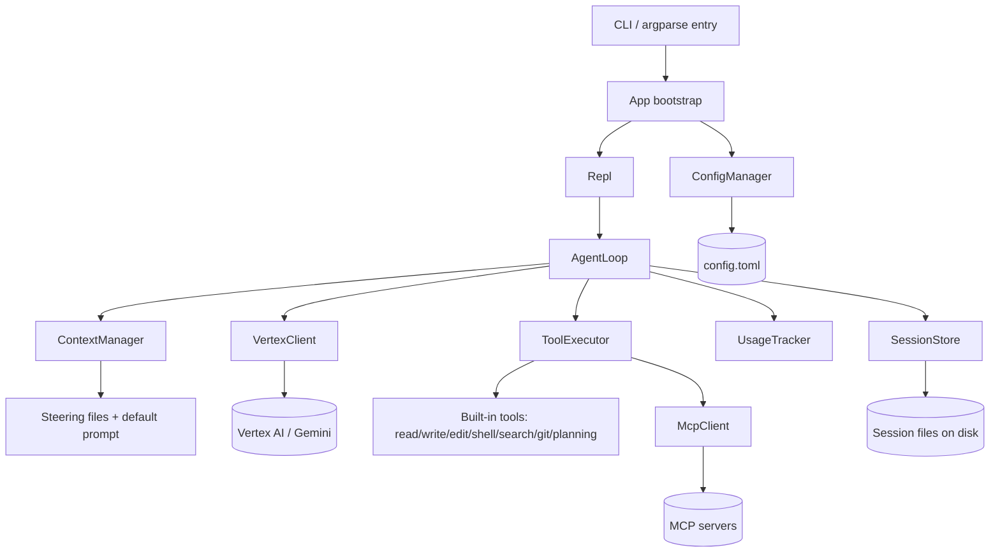
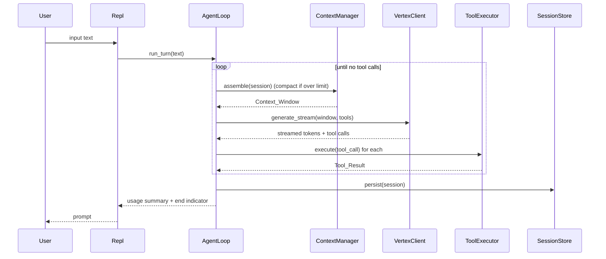

# Design Document: Forge

## Overview

Forge is a single-binary-style Python application that runs a terminal REPL driving an autonomous AI coding agent. A turn flows from user input, through context assembly, into a streamed Gemini request over Vertex AI, and back out as either terminal text or tool calls that Forge executes against the local workspace. The loop repeats until the model stops requesting tools, then Forge persists the session and reports usage.

The design favors a small number of cohesive components with narrow interfaces. All model access goes through one `VertexClient`; all tool execution goes through one `ToolExecutor` that owns a registry of tools; all persistence goes through one `SessionStore`. Cross-cutting concerns (config, context assembly, usage tracking) are isolated into dedicated managers so the agent loop stays thin.

### Research Notes Informing the Design

- **SDK choice.** The unified `google-genai` SDK is the current path for Gemini on Vertex AI and is the same package used across AI Studio and Vertex; it is initialized for Vertex with `genai.Client(vertexai=True, project=..., location=...)` and authenticates through ADC. It exposes `models.generate_content_stream(...)` for token streaming, function-calling via `types.Tool`/`types.FunctionDeclaration`, and per-response `usage_metadata` with input/output token counts. Sources: [Generative AI on Vertex AI — Python reference](https://cloud.google.com/vertex-ai/generative-ai/docs/reference/python/latest/services) and [streamGenerateContent reference](https://cloud.google.com/vertex-ai/docs/reference/rest/v1/publishers.models/streamGenerateContent). Content was rephrased for compliance with licensing restrictions.
- **MCP.** The official `mcp` Python SDK provides a stdio client and a session object that lists and calls tools. Forge wraps it so MCP tools appear in the same registry as built-in tools.
- **Decision:** Forge depends on `google-genai` (model access), `mcp` (MCP client), `tomllib` (stdlib TOML reader on 3.11+) with `tomli-w` for writing the init file, and `prompt_toolkit` for REPL line editing. The built-in search and edit engines are implemented in-house (no ripgrep dependency) per the requirements.

## Architecture



### Turn lifecycle



### Interrupt model

A single `InterruptController` installs a `SIGINT` handler (Ctrl-C). While idle at the prompt, Ctrl-C is a no-op cancel of the input line. During a turn it sets a `threading.Event`. The `VertexClient` checks the event between streamed chunks and aborts the stream; blocking tools (shell) run the child process in its own group and are terminated on interrupt; the `ToolExecutor` checks the event before and after each tool and converts a tripped event into an "interrupted" `Tool_Result`. The guarantee is that generation or a tool stops within 1 second because the polling interval between chunks/process-waits is sub-second.

## Components and Interfaces

The codebase is organized as a `forge` package:

```
forge/
  __main__.py          # CLI dispatch: forge [resume|list|init] ...
  app.py               # bootstrap, wiring, startup validation
  config.py            # ConfigManager, Config dataclasses, path resolution
  repl.py              # Repl: prompt loop, exit commands, rendering
  agent.py             # AgentLoop
  context.py           # ContextManager, compaction, token estimation
  vertex.py            # VertexClient (google-genai wrapper)
  usage.py             # UsageTracker
  session.py           # SessionStore, Session/Message models, serialization
  interrupt.py         # InterruptController
  tools/
    base.py            # Tool protocol, ToolExecutor, registry, ToolResult
    fs.py              # read, write, edit
    shell.py           # shell
    search.py          # search (regex + glob engine)
    git.py             # git
    planning.py        # planning/todo
    paths.py           # workspace path-scoping helper (shared)
  mcp_client.py        # McpClient
```

### ConfigManager (`config.py`)

```python
@dataclass(frozen=True)
class ModelPricing:
    input_per_1k: float | None
    output_per_1k: float | None

@dataclass(frozen=True)
class McpServerConfig:
    name: str
    command: str
    args: list[str]
    env: dict[str, str]

@dataclass(frozen=True)
class Config:
    model: str                       # default "gemini-3.1-pro-preview"
    project: str | None              # required, no default
    region: str | None               # required, no default
    enabled_tools: list[str]         # default builtin set
    token_limit: int                 # default 200_000
    retained_recent_messages: int    # default 20
    request_timeout_s: int           # default 60
    shell_timeout_s: int             # default 120
    output_cap_chars: int            # default 30_000
    search_result_limit: int         # default 100
    search_line_cap: int             # default 500
    read_max_lines: int              # default 2_000
    read_max_bytes: int              # default 1_000_000
    rate_limit_retries: int          # default 3
    mcp_connect_timeout_s: int       # default 30
    steering_files: list[str]
    mcp_servers: list[McpServerConfig]
    pricing: ModelPricing

class ConfigManager:
    @staticmethod
    def config_path() -> Path: ...          # OS-conventional config.toml
    @staticmethod
    def sessions_dir() -> Path: ...         # OS-conventional sessions dir
    def load(self) -> Config: ...           # apply defaults, validate, warn on unknown tools
    def write_default(self, path: Path) -> None: ...   # used by `forge init`
```

Path resolution: Windows config at `%APPDATA%\forge\config.toml`, sessions at `%APPDATA%\forge\sessions`; Unix/macOS config at `$XDG_CONFIG_HOME/forge/config.toml` (falling back to `~/.config/forge/config.toml`), sessions at `$XDG_DATA_HOME/forge/sessions` (falling back to `~/.local/share/forge/sessions`). Syntax errors raise a `ConfigError` carrying the file path plus the line and column from `tomllib.TOMLDecodeError`; the app prints it and exits non-zero. Unknown enabled tools produce a warning and are dropped from `enabled_tools`. (Requirements 11.1–11.9, 12.3)

**Startup sequencing (resolved):** when the Config_File is absent, `ConfigManager.load` applies the documented defaults and startup continues through config loading (Req 11.5) — a missing file is not itself fatal. A separate startup-validation step in `app.py` then checks for the required `project` and `region` values; if either is missing it prints guidance directing the user to run `forge init` (Req 12.3) and exits before the Vertex client is initialized. This distinguishes "continue startup through config loading" (11.5) from "required values still validated before the Vertex client initializes" (2.4): defaults let loading proceed, but the required project/region are validated immediately afterward.

**`forge init` when config already exists (resolved):** `write_default` is only invoked after `app.py` checks the conventional config location. If a Config_File already exists there, Forge reports that configuration already exists and leaves the existing file unchanged — it does not overwrite. Only when no file is present does `init` write the default structure with the required placeholders. (Req 12.2)

### VertexClient (`vertex.py`)

```python
class VertexClient:
    def __init__(self, config: Config, interrupt: InterruptController): ...
    def generate_stream(
        self,
        contents: list[dict],
        tools: list[ToolSpec],
    ) -> Iterator[StreamEvent]: ...   # yields TextDelta | ToolCall | UsageReport | Done
```

The client lazily constructs `genai.Client(vertexai=True, project=config.project, location=config.region)`. Missing ADC, missing project/region, auth errors, rate limits (retried up to `rate_limit_retries` with exponential backoff), and the 60-second request timeout are translated into typed exceptions (`CredentialsError`, `ConfigMissingError`, `AuthorizationError`, `RateLimitError`, `RequestTimeoutError`) that the agent loop renders without losing session state. `StreamEvent` is a small tagged union so the REPL can render text deltas, announce tool names, and capture `usage_metadata`. (Requirements 2.1–2.8, 3.1–3.4)

### AgentLoop (`agent.py`)

```python
class AgentLoop:
    def run_turn(self, session: Session, user_text: str) -> TurnResult: ...
```

`run_turn` appends the user message, then repeats: assemble context (capturing any `CompactionInfo` the `ContextManager` returns when compaction occurred), stream a model response (rendering tokens and tool-name announcements), collect tool calls, execute them in received order, append each `Tool_Result`, and continue until a response carries no tool calls. On interrupt it stops promptly, keeps completed messages/results, and returns. After the loop it triggers persistence and returns a `TurnResult` carrying the usage summary and any `CompactionInfo`, which the Repl renders as the compaction notice. (Requirements 1.2–1.5, 3.2, 4.1–4.7, 14.7)

### ContextManager (`context.py`)

```python
class ContextManager:
    def assemble(self, session: Session) -> tuple[list[dict], CompactionInfo | None]: ...
    def estimate_tokens(self, messages: list[dict]) -> int: ...
    def compact(self, session: Session) -> CompactionResult: ...
```

**Token estimation (resolved):** Forge uses a deterministic local heuristic — `ceil(total_unicode_chars / 4)` summed across the serialized text of every message plus a fixed per-message overhead — rather than a network call, so estimation is fast, offline, and reproducible. The 4-chars-per-token ratio is a standard conservative approximation; cumulative authoritative counts from `usage_metadata` are recorded separately by the `UsageTracker` for cost, but compaction decisions use the heuristic so they can run before the request.

**Compaction mechanism (resolved):** Forge compacts using the Model itself. When the estimated window exceeds `Token_Limit`, the manager partitions messages into (a) the system/steering prompt and the original task message, (b) a middle region of older messages, and (c) the most recent `retained_recent_messages` messages plus any pending tool calls whose results are not yet present. The middle region is sent to the Model in a separate, bounded summarization request that asks for a structured summary preserving decisions and outcomes; the returned summary replaces the middle region as a single synthetic message. If the post-compaction estimate still exceeds the limit, the manager drops retained-recent messages from oldest to newest (never dropping the task, the system prompt, or pending tool calls) until it reaches the limit or cannot shrink further, in which case it emits a warning and proceeds with the smallest well-formed window. When compaction occurs, `assemble` returns a `CompactionInfo` alongside the window; the `AgentLoop` surfaces it on the `TurnResult` and the Repl renders the "conversation context was compacted" notice to the terminal. (Requirements 14.1–14.9)

**System prompt assembly:** the built-in default prompt is always first, followed by configured steering file contents in listed order; missing steering files produce a warning and are skipped. (Requirements 15.1–15.4)

**Built-in default system prompt (resolved):** shipped as a package data file `forge/data/system_prompt.md` and loaded via `importlib.resources`. It establishes Forge as an autonomous terminal coding agent, enumerates the available tools and their contracts, states the workspace boundary, and instructs the model to plan multi-step work with the planning tool and to stop when the task is complete.

### ToolExecutor and tools (`tools/`)

```python
@dataclass(frozen=True)
class ToolResult:
    ok: bool
    content: str
    error: str | None = None
    meta: dict = field(default_factory=dict)   # e.g. {"truncated": True}

class Tool(Protocol):
    name: str
    description: str
    parameters: dict           # JSON schema for the model
    def validate(self, args: dict) -> str | None: ...   # None == valid
    def run(self, args: dict, ctx: ToolContext) -> ToolResult: ...

class ToolExecutor:
    def __init__(self, registry: dict[str, Tool], enabled: set[str],
                 interrupt: InterruptController): ...
    def specs(self) -> list[ToolSpec]: ...     # only enabled + MCP tools
    def execute(self, call: ToolCall) -> ToolResult: ...
```

`execute` resolves the tool by name (unknown/disabled → "unavailable" result), runs `validate` (failure → validation-error result without side effects), checks the interrupt, then runs the tool. The shared `paths.resolve_in_workspace(path)` helper canonicalizes a path against the workspace root and rejects anything that escapes it (used by read/write/edit/search). (Requirements 4.1, 4.6, 4.7, 11.8)

Tool-specific contracts:
- **read** (`fs.py`): UTF-8 decode, optional inclusive line range bounded to the file, not-found / out-of-scope / invalid-range / binary / truncation handling. (Req 5)
- **write/edit** (`fs.py`): write replaces content and creates parent dirs and reports bytes written; edit requires the target string to occur **exactly once** (zero → not found, more than one → ambiguous), with not-found and out-of-scope and filesystem-error handling that leave the filesystem unchanged on failure. (Req 6)
- **shell** (`shell.py`): runs via the platform default shell, captures stdout/stderr/exit code, enforces the 120s timeout and 30k-char cap, handles empty command and interrupt. **Platform handling (resolved):** on Windows, commands run through `cmd.exe /C <command>`; on Unix/macOS through `/bin/sh -c <command>`. The child process is spawned with `cwd` set to the Workspace root so commands run within the Workspace as required. The child runs in a new process group (`start_new_session=True` on POSIX, `CREATE_NEW_PROCESS_GROUP` on Windows) so interrupts and timeouts kill the whole tree. Running Windows commands through `cmd.exe /C` rather than PowerShell is a deliberate design choice for predictable command-string semantics, narrowing the requirements' "cmd or PowerShell" assumption; the shell could be made configurable in a later version. (Req 7.1, 7)
- **search** (`search.py`): in-house engine. Content mode compiles the pattern with `re` (invalid pattern → error result) and walks the workspace yielding path/line-number/line, applying the 100-match limit and 500-char line cap; glob mode uses `pathlib` globbing. (Req 8)
- **git** (`git.py`): dispatches exactly the enumerated operations through the `git` binary in the workspace; rejects unsupported operations, reports not-a-repo, surfaces non-zero exit with captured stderr, and applies the 30k cap. (Req 9)
- **planning** (`planning.py`): stores up to 100 todo items in session-scoped state, updates item status within {pending, in_progress, completed}, returns the current list, and signals the REPL to render the list on change; updating an absent item is a no-op error result. (Req 10)

### McpClient (`mcp_client.py`)

```python
class McpClient:
    def connect_all(self, servers: list[McpServerConfig]) -> list[Tool]: ...
    def call(self, server: str, tool: str, args: dict) -> ToolResult: ...
    def close(self) -> None: ...
```

At startup it connects to each configured server (30s budget each), discovers tools, and adapts them to the `Tool` protocol. A connect failure warns and continues. Name collisions with built-in tools keep the built-in and exclude the MCP tool with a warning. Call-time errors/unreachable servers become failure `Tool_Result`s. (Requirements 16.1–16.6)

### UsageTracker (`usage.py`)

```python
class UsageTracker:
    def record(self, input_tokens: int, output_tokens: int) -> None: ...
    def turn_summary(self) -> UsageSummary: ...   # turn + cumulative, cost or "unavailable"
```

Records per-response token counts from `usage_metadata`, computes cumulative totals, and computes cost from `Config.pricing`; if pricing is absent it reports tokens with cost marked unavailable. (Requirements 17.1–17.5)

### Repl (`repl.py`)

Owns the prompt loop: reads a line, treats `/exit` and `/quit` as termination, ignores empty/whitespace-only input, otherwise calls `AgentLoop.run_turn`. Renders streamed text within 200 ms per token, announces tool names, prints an end-of-response indicator, renders todo lists on change, renders the "conversation context was compacted" notice when a turn reports compaction, and prints the usage summary. The compaction notice flows up from `ContextManager.assemble` (which returns a `CompactionInfo` when compaction occurred) through the `AgentLoop` (which surfaces that `CompactionInfo` on the `TurnResult`) to the Repl, which is the component that renders it to the terminal. (Requirements 1.1, 1.6, 1.7, 3.1–3.3, 10.3, 14.7, 17.3)

## Data Models

### Config TOML schema

```toml
model = "gemini-3.1-pro-preview"
project = "REPLACE_WITH_GCP_PROJECT_ID"   # required placeholder
region  = "REPLACE_WITH_GCP_REGION"       # required placeholder

enabled_tools = ["read", "write", "edit", "shell", "search", "git", "planning"]

[limits]
token_limit              = 200000
retained_recent_messages = 20
request_timeout_s        = 60
shell_timeout_s          = 120
output_cap_chars         = 30000
search_result_limit      = 100
search_line_cap          = 500
read_max_lines           = 2000
read_max_bytes           = 1000000
rate_limit_retries       = 3
mcp_connect_timeout_s    = 30

[pricing]
input_per_1k  = 0.00125   # optional; omit to disable cost estimation
output_per_1k = 0.005

steering_files = []        # ordered list of paths

[[mcp_servers]]
name    = "example"
command = "python"
args    = ["-m", "my_mcp_server"]
# env   = { KEY = "value" }
```

`forge init` writes exactly this structure with the documented defaults and the two required placeholders. (Requirements 11.1–11.4, 12.1)

### Session schema (serialization format: JSON)

Each session is one JSON file named `<session_id>.json` (`session_id` is a UUIDv4) in the sessions directory. JSON is chosen for human-inspectability and lossless round-tripping of the message structure.

```python
@dataclass
class ToolCall:
    id: str
    name: str
    args: dict

@dataclass
class ToolResultRecord:
    call_id: str
    ok: bool
    content: str
    error: str | None
    meta: dict

@dataclass
class Message:
    role: str                 # "system" | "user" | "model" | "tool"
    text: str | None
    tool_calls: list[ToolCall]        # present on model messages
    tool_result: ToolResultRecord | None   # present on tool messages

@dataclass
class TodoItem:
    id: str
    text: str
    status: str               # "pending" | "in_progress" | "completed"

@dataclass
class Usage:
    input_tokens: int
    output_tokens: int
    estimated_cost: float | None

@dataclass
class Session:
    id: str
    created_at: str           # ISO-8601 UTC
    updated_at: str           # ISO-8601 UTC
    messages: list[Message]
    todos: list[TodoItem]
    usage: Usage
```

```python
class SessionStore:
    def __init__(self, root: Path): ...
    def save(self, session: Session) -> None: ...   # atomic, serialized
    def load(self, session_id: str) -> Session: ...  # raises CorruptSessionError
    def list(self) -> list[SessionMeta]: ...          # id + created_at
    def new(self) -> Session: ...
```

Atomic persistence writes to a temp file in the same directory and `os.replace`s it onto the target; an in-process per-session lock serializes concurrent writes. A file that fails to parse raises `CorruptSessionError` and the on-disk bytes are left untouched. (Requirements 13.1–13.7)

### CLI surface (resolved)

```
forge                      # start a fresh session REPL
forge init                 # create config.toml with defaults + placeholders
forge list                 # list saved sessions (id + creation timestamp)
forge resume <session_id>  # restore a session and continue in the REPL
```

`list` reads `SessionStore.list()`; `resume` loads the session (unknown id → error message; corrupt file → error naming the session) and seeds the agent loop with the restored messages as the context window. (Requirements 12.1–12.2, 13.4–13.7)

### Tool call / result wire shape

Model-emitted `ToolCall` (`{id, name, args}`) and Forge-produced `ToolResult`/`ToolResultRecord` (`{ok, content, error, meta}`) are the single structures shared across the agent loop, executor, MCP client, and session records, keeping serialization uniform.

## Correctness Properties

*A property is a characteristic or behavior that should hold true across all valid executions of a system — essentially, a formal statement about what the system should do. Properties serve as the bridge between human-readable specifications and machine-verifiable correctness guarantees.*

The following properties were derived from the acceptance-criteria prework and consolidated to remove redundancy (e.g., path-scoping across file/search tools, the three edit-uniqueness cases, and the compaction retention/bound criteria are each unified into a single comprehensive property).

### Property 1: Exit-command classification

*For any* input string, Forge classifies it as an exit command if and only if it is exactly `/exit` or `/quit`.

**Validates: Requirements 1.6**

### Property 2: Blank input is ignored

*For any* string consisting solely of whitespace (including the empty string), the REPL classifies it as ignorable and does not invoke the Agent_Loop.

**Validates: Requirements 1.7**

### Property 3: Tool calls execute in received order

*For any* sequence of tool calls returned in a model response, the Tool_Executor executes them in exactly the received order and the Agent_Loop appends exactly one Tool_Result per call within the same turn.

**Validates: Requirements 1.4, 1.5**

### Property 4: Only enabled, recognized tools are exposed and runnable

*For any* configured set of enabled tool names, the set of tools exposed to the Model equals the recognized built-in (plus accepted MCP) tools intersected with the enabled set, and invoking any name not in that exposed set yields an "unavailable" Tool_Result with no side effects.

**Validates: Requirements 4.6, 11.7, 11.8**

### Property 5: Invalid arguments never cause side effects

*For any* tool call whose arguments fail validation, the Tool_Executor returns a validation-error Tool_Result and the workspace and session state are left unchanged.

**Validates: Requirements 4.7**

### Property 6: Workspace path-scoping invariant

*For any* path argument to the read, write, edit, or search tools that resolves outside the Workspace root, the tool returns an "out of scope" Tool_Result and performs no read or write outside the Workspace.

**Validates: Requirements 5.4, 6.6**

### Property 7: Read line-range slice

*For any* text file and any valid line range, the read tool returns exactly the lines from `start` through `end` inclusive and no others.

**Validates: Requirements 5.2**

### Property 8: Invalid line range rejected

*For any* line range whose start is below 1, whose end exceeds the file's last line, or whose start exceeds its end, the read tool returns an "invalid range" Tool_Result.

**Validates: Requirements 5.5**

### Property 9: Read truncation cap

*For any* file content, the read tool returns at most 2,000 lines and at most 1 MB, and flags the result as truncated whenever the file exceeds either bound.

**Validates: Requirements 5.7**

### Property 10: Write round-trip, byte count, and parent creation

*For any* content and any relative path within the Workspace (including paths with non-existent parent directories), after the write tool runs, reading the path back yields the written content, the reported byte count equals the encoded length, and all missing parent directories exist.

**Validates: Requirements 6.1, 6.2, 5.1**

### Property 11: Edit uniqueness invariant

*For any* file and target string: if the target occurs exactly once, the edit tool replaces that single occurrence and leaves all other bytes unchanged; if it occurs zero times the result is "not found"; if it occurs more than once the result is "ambiguous"; and in both non-unique cases the file is left byte-for-byte unchanged.

**Validates: Requirements 6.3, 6.4, 6.5**

### Property 12: Shell and git output char cap

*For any* command output, the shell and git tools return at most 30,000 characters and flag the result as truncated whenever the output exceeds that cap.

**Validates: Requirements 7.5, 9.6**

### Property 13: Search match correctness

*For any* file set and valid content pattern, every result the search tool returns names a real file, a 1-based line number, and a line that actually contains a regex match at that location.

**Validates: Requirements 8.1**

### Property 14: Search result and line caps

*For any* file set and pattern producing matches, the search tool returns at most 100 matches (flagging truncation when exceeded) and each returned line is at most 500 characters (flagging line truncation when exceeded).

**Validates: Requirements 8.4, 8.6**

### Property 15: Glob correctness

*For any* file set and file-name glob, the search tool returns exactly the set of Workspace paths matching the glob.

**Validates: Requirements 8.2**

### Property 16: Git operation dispatch

*For any* operation name, the git tool dispatches it if and only if it is one of {status, diff, log, show, add, commit, branch, checkout, stash}, and returns "unsupported" for every other name.

**Validates: Requirements 9.1, 9.4**

### Property 17: Todo store, update, and status invariants

*For any* list of up to 100 todo items, storing them returns an equal list; updating the status of a present item changes only that item to a value within {pending, in_progress, completed} and leaves all others unchanged; an out-of-set status or an update to an absent item is rejected and leaves the list unchanged.

**Validates: Requirements 10.1, 10.2, 10.4, 10.6**

### Property 18: Config defaults merge

*For any* partial configuration (any subset of settings omitted), the loaded Config has every omitted setting equal to its documented default and every present setting preserved.

**Validates: Requirements 11.4**

### Property 19: Init config round-trip

*For any* fresh environment, the file written by `forge init` parses as valid TOML and loads back to a Config equal to the documented defaults with the required project and region placeholders present.

**Validates: Requirements 12.1**

### Property 20: Session serialization round-trip

*For any* Session (arbitrary messages, tool calls, tool results, todos, and usage), serializing then deserializing produces an equal Session, and a saved session appears in the store listing with its identifier and creation timestamp.

**Validates: Requirements 13.1, 13.4, 13.5**

### Property 21: Compaction bound and retention invariant

*For any* Session, after compaction the assembled Context_Window's estimated token count is at or below the Token_Limit, or — when it cannot be reduced that far — is the smallest well-formed window the manager can produce; in all cases the built-in system prompt, the original task/instructions, and every pending Tool_Call without a Tool_Result are retained, and the most recent configured count of messages is retained whenever the bound allows.

**Validates: Requirements 14.1, 14.3, 14.5, 14.6, 14.8, 14.9**

### Property 22: Steering prompt ordering

*For any* ordered list of existing steering files, the assembled system context places the built-in default prompt first, followed by each steering file's contents in configured order.

**Validates: Requirements 15.1, 15.2, 15.3**

### Property 23: MCP name-collision resolution

*For any* combination of built-in tool names and discovered MCP tool names, the resolved tool registry keeps the built-in tool for every colliding name and excludes the conflicting MCP tool, while non-colliding MCP tools remain available.

**Validates: Requirements 16.6**

### Property 24: Usage accumulation and cost

*For any* sequence of per-response (input, output) token counts, the Usage_Tracker's cumulative input and output totals equal the respective sums, and when pricing is configured the estimated cost equals the configured per-token rates applied to those totals.

**Validates: Requirements 17.1, 17.2, 17.4**

## Error Handling

Errors are split into two families.

**Startup/fatal errors** stop the process with a clear message and non-zero exit: missing ADC (names the credentials and the `gcloud auth application-default login` command), missing project/region (names the value and directs to `forge init`), and TOML syntax errors (names the file with line/column). These are raised as typed exceptions and handled once in `app.py`.

**Recoverable turn errors** never crash the REPL and never lose session state. The agent loop wraps each model request and each tool execution; authorization errors, rate-limit exhaustion (after 3 retries), request timeouts (60s), and stream interruptions are rendered as a message, the session is preserved (already-completed messages/results retained), and control returns to the prompt. Tool-level failures (not found, out of scope, ambiguous edit, invalid range, invalid regex, empty command, shell/git non-zero exit, filesystem errors, MCP failures) are returned to the Model as structured `Tool_Result`s with `ok=false` rather than raised, so the Model can adapt within the turn. Filesystem-mutating tools guarantee no partial mutation on failure (validate-then-act; writes go through a temp file and atomic replace where applicable).

Corrupt or unparseable session files raise `CorruptSessionError`, leave the on-disk bytes untouched, and surface an error naming the affected session. Missing steering files and unrecognized enabled tools and failed MCP connections degrade gracefully with warnings and continued startup.

## Testing Strategy

Forge uses a dual approach: example/edge-based unit tests for specific scenarios and error paths, and property-based tests for the universal invariants above.

**Property-based testing.** Forge is well suited to PBT: the file edit/read/search engines, config merging, session serialization, compaction, usage accounting, and tool-registry resolution are pure or near-pure functions with large input spaces. Tests use the **Hypothesis** library (the standard Python PBT framework) — not a hand-rolled generator. Each correctness property maps to a single Hypothesis test configured for at least 100 iterations (`@settings(max_examples=100)`), with custom strategies for files (line lists, byte blobs including non-UTF-8), workspaces (relative and escaping paths), sessions (messages/tool-calls/results/todos), partial config dicts, todo lists, and token-count sequences. Filesystem properties run against a per-example `tmp_path` workspace. Network, Vertex AI, and MCP transports are mocked so logic-layer properties stay fast and offline. Each property test is tagged with a comment of the form:

`# Feature: forge, Property {number}: {property_text}`

**Unit and integration tests.** Example-based tests cover the REPL control flow with a scripted mock model (1.1–1.3, 1.5), Vertex error/retry/timeout paths with injected responses (2.1–2.8, 3.x), interrupt behavior (4.1–4.5, 7.4), shell happy/non-zero/timeout paths (7.1–7.3, 7.6), git happy/not-a-repo/non-zero paths (9.2, 9.3, 9.5), atomic and sequential session writes (13.2, 13.3), unknown/corrupt session resume (13.6, 13.7), init-already-exists and missing-required-value startup (12.2, 12.3), compaction trigger and notice (14.2, 14.4, 14.7), steering warnings (15.4), and cost-unavailable display (17.5). MCP connect/discover/forward behavior (16.1–16.5) is verified with a stub MCP server over stdio in 1–3 integration tests rather than property tests, since it exercises external transport rather than input-varying logic. ADC authentication (2.2) is a smoke/integration check, and the git supported-set (9.1) and TOML-format (11.1) criteria are covered by configuration assertions.
